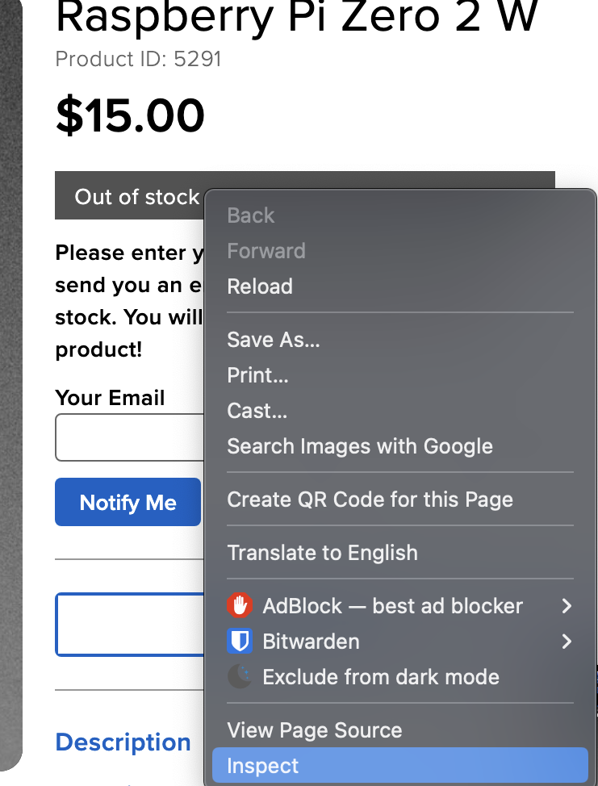
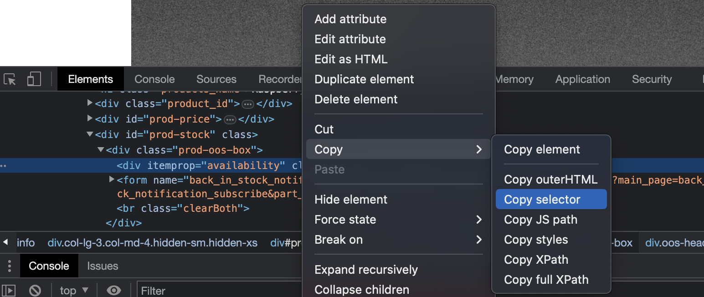
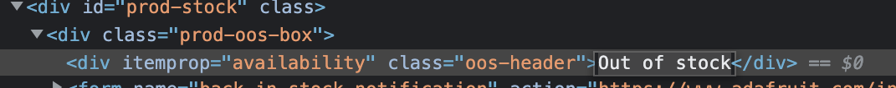

# Raspberry Pi Stock Checker

## How to add new config file

1. Right click HTML element that notifies user of out of stock availability and select inspect

   

2. right click on element in the inspect menu and click Copy > Copy Selector
   
3. Paste result in yaml file under
4. Copy text that indicates out of stock
   

   paste text in yaml file

5. paste url in yaml file
6. add a name to config and save yaml file in config directory with extension ".yaml"

### YAML File Template

```yaml
# yaml template
name: # [string] Give a descriptive name
baseUrl: # [string] url of target product
outOfStockIndicator:
  styleAttributeName: # [string] HTML selector
  indicator: # [string] Text used to determine if out of stock
```
